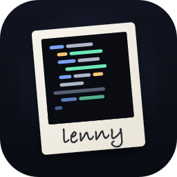
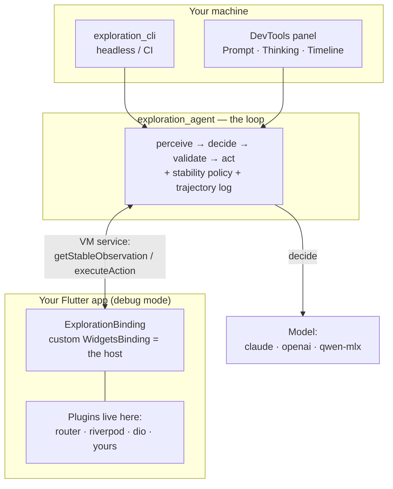

<p align="center">
  
</p>

<h1 align="center">Lenny</h1>

<p align="center">
  <strong>An agent that drives a real Flutter app — and knows when it's done reacting.</strong>
</p>

<p align="center">
  
  
  
  
</p>

---

Lenny is an agent harness for running Flutter apps in debug mode. It taps, types,
scrolls, and looks — the way a person would — but it always waits for the frame to
settle first, and lets the app's own libraries report what's going on. The result
is **one trustworthy observation per turn**.

> Okay, so what am I doing? Oh, I'm chasing this guy. No, he's chasing me.
>
> — [Leonard Shelby](https://duckduckgo.com/?q=memento)

## The problem: agents look too early

Watch an LLM drive a browser and you see the failure mode — it clicks, immediately
reads a half-rendered DOM, and acts on that snapshot. It's racing animations, network
calls, and partial updates. A large fraction of agent failures are simply *"I looked
too early."*

Flutter is structurally different in a way that helps:

- **Frame lifecycle.** Flutter's scheduler knows when work is pending and when a frame
  has committed — so *"is the app still settling?"* has a real answer.
- **Semantics tree.** The screen-reader view of the UI gives interactable elements at a
  clean level of abstraction, not raw pixels.
- **VM-service hook.** A debug-mode app exposes a service the harness drives over the
  wire — observe, then act.

Put together: **observe a settled, structured snapshot; then act.** One trustworthy
observation per turn.

## How it works

The host is a small, opinion-free core — literally a custom `WidgetsBinding`. It claims
the framework's lifecycle slot in `main()`, registers a handful of VM-service
extensions, and otherwise gets out of the way. Outside debug/profile mode it doesn't
install at all.

Everything app-specific lives in **plugins** that ship *in your app* — each contributes
some mix of extra **tools** (e.g. `router.navigate`), **observation fragments** (the
current route stack, which providers are loading), and **lifecycle hooks**. The core
stays tiny and policy-free; plugins know about your router, your state, your network
client.



Every turn is the same shape:

1. **Stabilize** — wait until the framework *and* every plugin agree the app is done reacting.
2. **Observe** — capture one structured snapshot: semantics tree, route stack, errors, plugin fragments.
3. **Decide** — a mechanical diff vs. the last turn plus the model's running summary → the model picks a tool.
4. **Validate** — reject impossible or malformed tool calls *before* they hit the live app, so a bad call costs a re-prompt, not a turn.
5. **Act** — run the tool (core or plugin) and append the turn to the trajectory log.

For the full, illustrated tour, read [`docs/how-lenny-works.md`](docs/how-lenny-works.md).

## Packages

This is a Melos monorepo. The harness is frontend- and framework-agnostic; the host and
plugins are where Flutter specifics live.

| Package | What it is |
| --- | --- |
| [`exploration_agent`](packages/exploration_agent) | The harness loop — web-compatible, frontend-agnostic. Stability policy, action validation, trajectory log, and the model providers. |
| [`exploration_flutter`](packages/exploration_flutter) | The host: a custom `WidgetsBinding` that claims the lifecycle slot in `main()` and exposes the VM-service extensions the harness drives. |
| [`exploration_cli`](packages/exploration_cli) | Headless frontend — connects to a running app's VM service and streams a trajectory to disk. |
| [`exploration_devtools`](packages/exploration_devtools) | In-IDE DevTools extension — the same loop in a panel, with live **Prompt**, **Thinking**, and **Timeline** views. |
| [`exploration_router`](packages/exploration_router) | Reference plugin — route-stack observation and a `router.navigate` tool. |
| [`exploration_riverpod`](packages/exploration_riverpod) | Reference plugin — reports which providers are loading. |
| [`exploration_dio`](packages/exploration_dio) | Reference plugin — reports (and can cancel) in-flight HTTP requests. |
| [`perception`](packages/perception) | Pure-Dart declarative perception core — experimental foundation (see [ADR 0001](docs/adrs)). |

## Getting started

> **Prerequisites:** the [Flutter SDK](https://docs.flutter.dev/get-started/install)
> (Dart 3.11+, Flutter 3.41+). Lenny runs against apps in **debug or profile mode** —
> it relies on VM-service extensions that don't exist in release builds.

### 1. Install the host in your app

The minimal integration installs the binding and runs your app unchanged:

```dart
import 'package:exploration_flutter/exploration_flutter.dart';
import 'package:flutter/material.dart';

void main() {
  // Installs the host in debug/profile mode; a no-op in release.
  ExplorationBinding.ensureInitialized(plugins: const <ExplorationPlugin>[]);
  runApp(const MyApp());
}
```

To teach the agent about your router, state, and network client, add reference plugins
(or your own). See [`example/sample_app`](packages/exploration_flutter/example/sample_app)
for a full `go_router` + Riverpod + Dio wiring.

### 2. Run your app and grab the VM-service URI

```sh
flutter run --debug
# Flutter prints: "A Dart VM Service ... is available at: ws://127.0.0.1:54321/abc=/ws"
```

### 3. Drive it

Headless, via the CLI:

```sh
export ANTHROPIC_API_KEY=sk-ant-…
dart run exploration_cli \
  --vm-uri ws://127.0.0.1:54321/abc=/ws \
  --goal "open settings and enable dark mode"
```

…or interactively: open Flutter DevTools for the running app and pick the **Exploration**
tab (provided by `exploration_devtools`) to drive the same loop and watch the model think
live.

### Model backends

| `--model` | Backend | Required env |
| --- | --- | --- |
| `claude` *(default)* | Anthropic | `ANTHROPIC_API_KEY` |
| `openai` | OpenAI | `OPENAI_API_KEY` |
| `qwen-mlx` | local Qwen MoE via [swift-infer](packages/exploration_cli/README.md#swift-infer-gateway-qwen-mlx) | `SWIFT_INFER_ENDPOINT`, `SWIFT_INFER_AGENT_TOKEN` |

## Write a plugin

A plugin is a small Dart class that lives in *your* app's `pubspec.yaml`, not in the
harness. It can declare tools, contribute an observation fragment in its library's own
native shape, and gate the stability check. The host namespaces every plugin's tools
(`router.*`, `riverpod.*`, `dio.*`), budgets their output, and orders their hooks.

See the [plugin authoring guide](docs/plugin_authoring_guide.md), and the three
reference plugins above for working examples.

## Build & test

Install [Melos](https://melos.invertase.dev/) once, then run from the repo root:

```sh
dart pub global activate melos

melos run test       # all unit/widget tests (excludes perf + the env-gated dogfood e2e)
melos run analyze    # dart analyze across the workspace
melos run format     # formatting check
melos run            # list every available script
```

## Status

Lenny is a **proof of concept**. The architecture is real and the loop runs end to end,
but APIs will move, coverage is partial, and you should expect rough edges. It is:

- **Flutter only** — not React Native, not native iOS/Android, not the web DOM.
- **Debug/profile mode only** — release builds don't expose the VM-service extensions it needs.
- **Not a codegen or test-authoring tool** — it acts on a *running* app; it never writes app code.
- **Not a training pipeline** — it collects trajectories; what you do with them is downstream.

Where it's headed: [`docs/flutter_exploration_agent_prd_v0.5.md`](docs/flutter_exploration_agent_prd_v0.5.md).

## Documentation

- [How Lenny works](docs/how-lenny-works.md) — an illustrated tour of the loop and the plugin contract.
- [Plugin authoring guide](docs/plugin_authoring_guide.md) — write a plugin for your stack.
- [PRD v0.5](docs/flutter_exploration_agent_prd_v0.5.md) — the full design rationale.
- [Architecture decision records](docs/adrs) — the decisions and why.

## License

[MIT](LICENSE) © 2026 Nico Spencer
