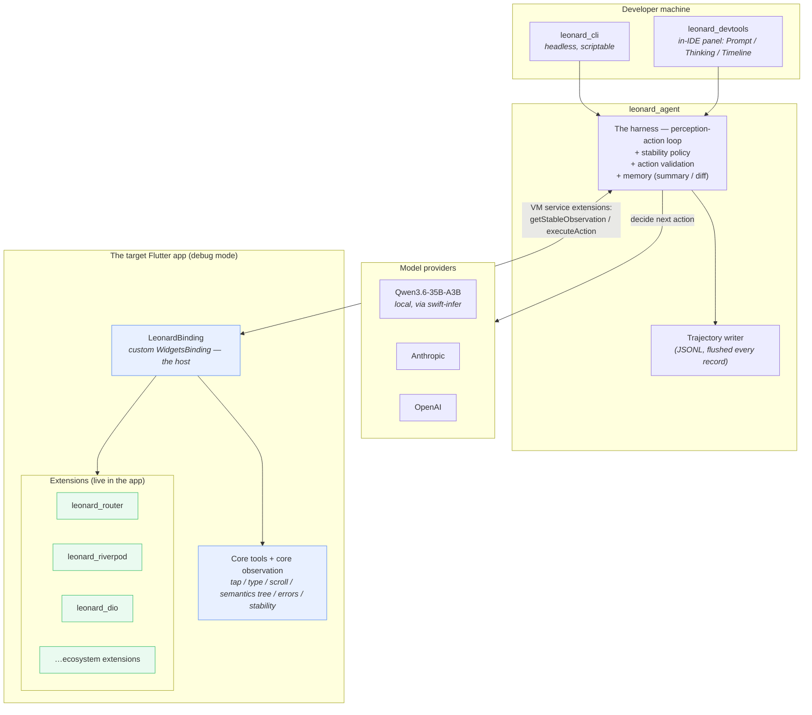
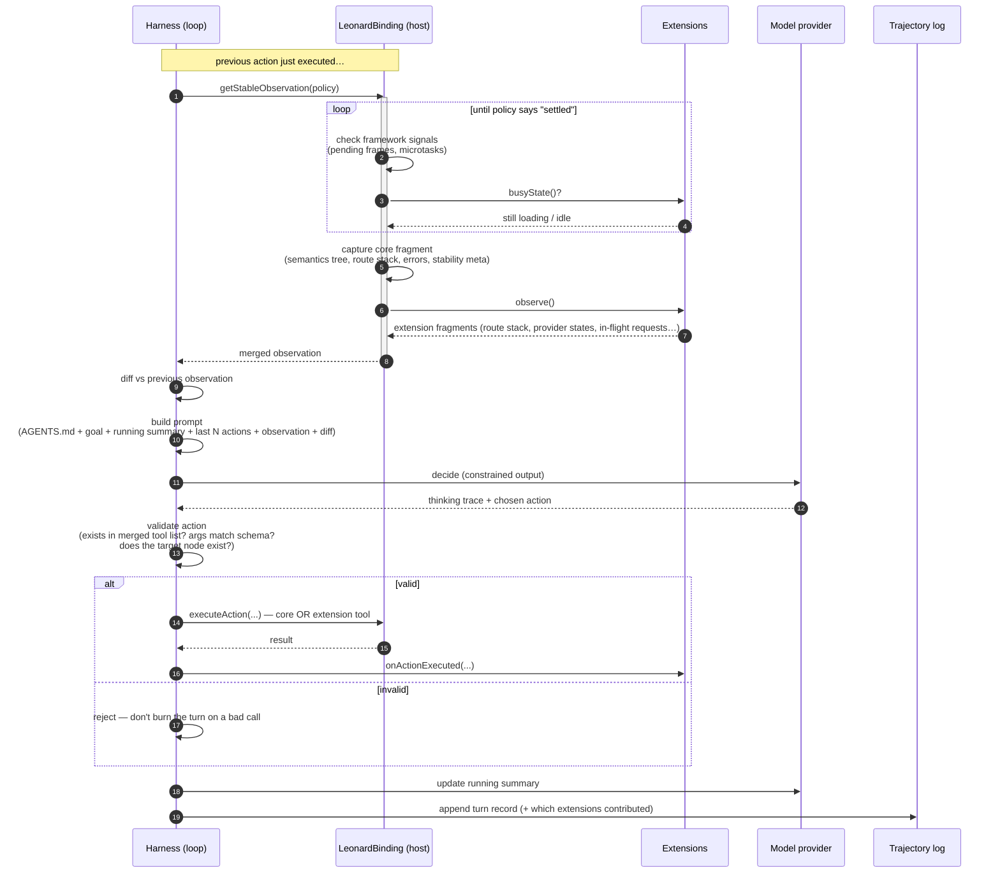
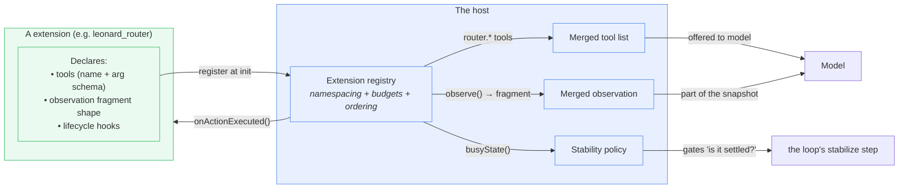
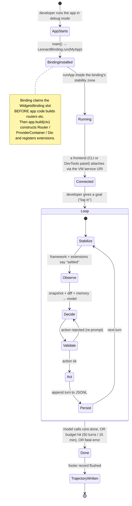

# How Leonard Works — an informal tour

> A talk-friendly explainer. Audience: engineers who get LLMs and agents but
> don't live inside Flutter's guts. No prior Flutter knowledge required — the
> bits that matter are explained inline.

## The one-sentence version

**Leonard is an agent harness that drives a *real running Flutter app* the way a
human would — tap, type, scroll, look — except it always knows when the app has
finished reacting, and it lets the app's own libraries tell it what's going on.**

That last clause is the whole bet. More on it below.

---

## Why bother — the bet

The question Leonard set out to answer: can you wire an LLM straight into a live
Flutter app — over the Dart VM service — and have it perceive the app's real state
and drive itself through it, turn after turn?

The hard part is perception. A UI agent is only as good as its observation, and the
classic failure is acting *too early* — the agent does something, immediately reads
the screen, and acts on a half-settled snapshot. It's racing animations, network
calls, and partial renders. A big chunk of agent failures are "I looked too early."

Flutter is structurally different in a way that helps:

- **The framework exposes its own frame lifecycle.** There's a scheduler that
  knows when work is pending and when a frame has committed. You can ask "is the
  app still settling?" and get a real answer.
- **There's a screen-reader-grade view of the UI.** The *semantics tree* — what
  VoiceOver/TalkBack would read — gives you interactable elements at a clean level
  of abstraction. The agent acts against that, not raw pixels.
- **There's a public extension channel into the running app.** Any package in a
  debug-mode Flutter app can register handlers on the VM service protocol. That's
  our hook.

So instead of "look → guess → hope," Leonard gets: *act → wait until the
framework says it's stable → read a structured observation → decide.* One turn =
one trustworthy snapshot.

---

## The big architectural idea: a tiny host, and extensions

Here's the thing that makes Leonard different from the existing Flutter agent tools
(the Dart MCP server, Marionette): **the agent loop is general, but the things it
needs to know about *your specific app* are not.**

Your app uses *some* router (`Navigator`, `go_router`, `auto_route`, `beamer`,
raw `Router`…). It uses *some* state management (Riverpod, BLoC, Provider…). It
talks to the network through *some* client (Dio, http, Chopper…). No single tool
can ship good support for all of those and keep it maintained. A unified
abstraction over "routing" is lossy — worse than letting each router describe
itself in its own shape.

So Leonard splits in two:

- **The host** — a small, opinion-free core. Owns the perception-action loop, the
  stability rule, action validation, and the trajectory log. Knows *nothing* about
  any specific routing/state/networking library.
- **Extensions** — small Dart packages that live *in your app*. Each one contributes
  some mix of: extra **tools** the agent can call, extra **observation fragments**
  ("here's the current route stack," "here's which providers are loading"), and
  **lifecycle hooks**. We ship reference extensions for Flutter's built-ins; the
  ecosystem can ship the rest.

The host's job is to be a good extension host. The extensions' job is to know about
specific things.

---

## Diagram 1 — the pieces and how they connect

A few things worth saying out loud:

- **One harness, two frontends.** The loop is a *library*, not a program. The CLI
  is the headless face (CI, batch trajectory collection). The DevTools extension
  is the interactive face — it runs *the same loop, in-panel*, and shows you the
  model's thinking live. Neither reimplements anything.
- **The host is literally a `WidgetsBinding`.** Flutter lets you swap the object
  that owns the framework's lifecycle. Leonard's binding claims that slot in
  `main()`, registers a handful of VM-service extensions, and otherwise gets out
  of the way. Outside debug mode it doesn't install at all.
- **Extensions ship inside the app**, not inside the harness. That's why the agent
  can know about *your* router — your router's extension is in your `pubspec.yaml`.

---

## Diagram 2 — one turn of the loop

This is the heartbeat. Every turn is the same shape.

Why each piece earns its place:

- **Stabilize first (steps 2–7).** This is the anti-race move. The host won't even
  *look* until the framework and every extension agree the app is done reacting.
- **Diff is mechanical; summary is the model's.** Leonard keeps two kinds of memory:
  a per-turn *diff* the harness computes ("route changed, this node appeared"), and
  a *running summary* the model writes and rewrites ("I'm trying to log in; the
  email field rejected my input twice"). Plus the last 3–5 actions verbatim.
- **Validate before acting.** Local models fumble tool calls. Catching a malformed
  or impossible action *before* execution means it costs a re-prompt, not a wasted
  turn against the live app.
- **Extension tools are first-class.** `router.navigate('/settings')` jumps straight
  there without hunting through the UI. `dio.cancel_in_flight()` lets the agent do
  adversarial things. The model just picks a tool by name from the merged list; the
  harness validates it the same way regardless of who contributed it.

Turn budget: ~30s wall clock. Session budget: ~50 turns or ~15 minutes.

---

## Diagram 3 — what an extension actually plugs into

An extension is a Dart class. It can contribute three things, any subset:

So when you write `leonard_router`, you're saying:

- "Here's a `router.navigate(routeName, args?)` tool" → it shows up in the model's
  toolbox.
- "Here's my observation fragment: the current route stack, in *my* router's native
  shape" → it gets merged into every snapshot.
- "When there's a route transition animating, my `busyState()` returns busy" → the
  loop won't take an observation mid-transition.
- "After any action runs, call my `onActionExecuted()`" → the extension can keep its
  own bookkeeping straight.

The host enforces the rules around this — every extension's tools are namespaced
(`router.*`, `riverpod.*`, `dio.*`), there are budgets so a chatty extension can't
blow the context window, and lifecycle ordering is defined. Versioning posture:
extension updates aren't breaking changes; trajectory records note which extension
versions contributed so old logs stay readable.

---

## Diagram 4 — the life of a session

From "I want to test login" to a trajectory file on disk.

Two ordering details that bite if you get them wrong:

1. **The binding has to win the race for the `WidgetsBinding` slot.** Some routers
   (e.g. `go_router`) call `WidgetsFlutterBinding.ensureInitialized()` deep inside
   their constructor. If the app constructs one of those *before* the binding
   installs, the wrong binding wins. `LeonardBinding.run(app)` fixes this:
   claim the slot first, *then* hand the app a context to build its router/state/
   client. Any later `ensureInitialized()` becomes a no-op.
2. **It only installs in debug/profile mode.** Release builds don't have the VM
   service extensions Leonard depends on, so in `kReleaseMode` the binding isn't
   installed and no extensions register — `app.build` and `runApp` still run normally.

---

## The DevTools panel, briefly

The interactive frontend is a DevTools extension — a Flutter web app that shows up
as a "Leonard" tab whenever your app depends on `leonard_flutter`. Three
panels:

- **Prompt** — type the goal, pick a model, set budgets, hit Start.
- **Thinking** — the model's reasoning trace streams in live (the `<think>…</think>`
  content for the Qwen target), plus the action it chose and whether it validated.
  Watching this is the fastest way to tell if the agent's mental model of your app
  is coherent — way faster than reading the trajectory file afterward.
- **Timeline** — one row per turn (action + one-line diff + running summary). Click
  to expand into the full observation, reasoning, and validation result. Updates
  live, browsable after.

It runs the harness loop *inside the panel's own web app* — no extra process, no
IPC, it just renders the same in-memory session state the CLI drives.

---

## What Leonard deliberately is *not*

- **Not a codegen tool.** It acts on the running app; it never writes Flutter code
  or tests.
- **Not a replacement for the Dart MCP server / Marionette.** Those are
  IDE-assistant tools. Leonard is for harness work where *you* own the loop end to
  end. (A Marionette-equivalent *extension* is fair game; replacing Marionette isn't
  the goal.)
- **Not a training loop.** It collects trajectories. What you do with them is
  downstream — no RL, no fine-tuning pipeline in scope.
- **Not cross-platform UI testing.** Flutter only. Not React Native, not native
  iOS/Android.
- **Not for release builds.** Debug-mode VM service extensions are load-bearing.
- **Not trying to solve every router/state/network framework.** It solves *the
  contract*. Extensions solve the framework-specific parts.

---

## The takeaway slide

> **Wire an LLM straight into a running Flutter app: the Dart VM hands you the frame
> lifecycle, a semantics tree, and an extension channel — so Leonard's agent always
> acts on a settled, structured snapshot instead of a guess. And because every app is a different pile
> of libraries, the core stays tiny and policy-free while extensions — living in your
> app — teach the agent about your router, your state, your network client.**
>
> Small host. Smart extensions. One trustworthy observation per turn.

---

*For the full design rationale, see [`leonard_prd_v0.5.md`](./leonard_prd_v0.5.md).
For writing an extension, see [`extension_authoring_guide.md`](./extension_authoring_guide.md).*
